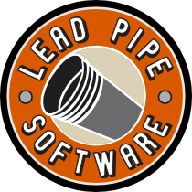

# LeadPipe RabbitHole

RabbitHole is a RabbitMQ message utility. It can:

* Save a copy of messages in a queue as a JSON file (snag)
* Send messages to a queue from a JSON file (queue)
* Get messages from a queue and put them on another queue (shuttle)
* Return messages to their source queue (replay)

## Commands

### Snag

Sometimes you want to save a copy of a message in a queue. Hey, you might even want to save the whole queue! That's where the snag command comes in handy.

```bash
$ ./rabbithole.exe snag -q MyRabbitQueue -m 1 -a snagged.json
```

### Queue

What about the other way around? Let's say you want to publish a message using a JSON-formatted source file. That's where the queue command steps in.

```bash
$ ./rabbithole.exe queue -d MyRabbitQueue -f snagged.json
```

### Shuttle

Need to move messages from one queue to another? The shuttle command has you covered.

```bash
$ ./rabbithole.exe shuttle -q FooQueue -d BarQueue -m 5
```

### Replay

What about simply re-playing a message by returning it to its source queue? Fire up the handy replay command!

```bash
$ ./rabbithole.exe replay -q FooQueue -m 5
```

## Configuration

RabbitHole is a command-line tool and almost every option can be specified as an argument. To see what you can do, just ask!

```bash
$ ./rabbithole.exe -h
```

To get help with a specific command simply supply the command name.

```bash
$ ./rabbithole.exe replay -h
```

In addition, RabbitHole supports the (optional) use of a configuration file.

[Lead Pipe Software](http://www.leadpipesoftware.com)
